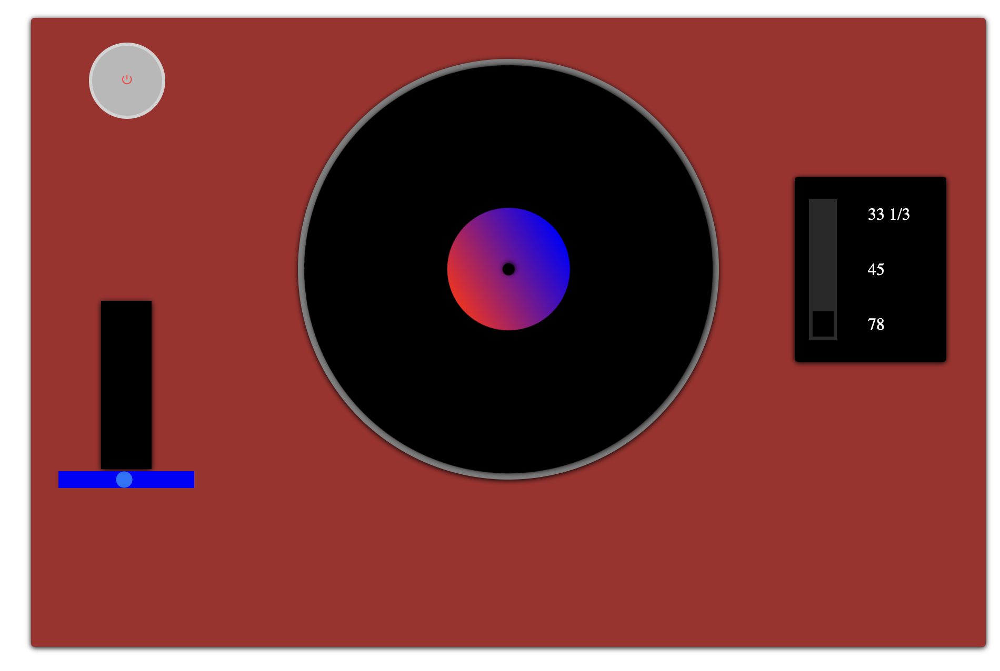
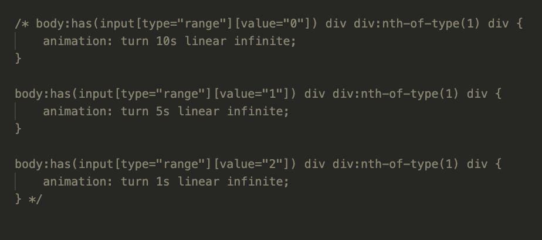
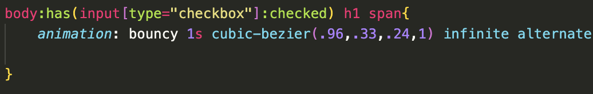

# WDD-CSS
 
<h2>Week 1</h2>

Week 1 was ik ziek tijdens de uitleg van de final assessment. Hierdoor keek ik thuis naar de presentatie en begon ik alvast met het kiezen van een case. Mijn eerste idee was om een Rubik's Cube te maken, maar dit bleek uiteindelijk vrij lastig. Daarom besloot ik een LP-speler te maken als control panel. Mijn eerste schets zag er als volgt uit:

<h2>Week 2</h2>
In de tweede week ben ik begonnen met het maken van de basis. Als eerste creëerde ik de LP-plaat zelf met behulp van *divs* en een checkbox als aan- en uitknop. Zodra de knop wordt ingeschakeld, moet de LP-plaat natuurlijk draaien. Dit heb ik met behulp van `:has()` vrij snel werkend gekregen.  

Vervolgens werkte ik aan de RPM-instelling van de LP-speler, waarmee je de draaisnelheid bepaalt. Ik begon met een slider met drie stappen. Nadat ik deze slider had uitgewerkt en gestyled, ben ik gaan testen hoe ik de snelheid kon aanpassen.

Uiteindelijk, na veel testen, ontdekte ik dat een range input de waarde niet direct in CSS bijwerkt. Hiervoor is een JavaScript-script nodig. Op dat moment wist ik nog niet dat er een kant-en-klaar JS-script beschikbaar was, dus koos ik ervoor om de slider met drie stappen te vervangen door drie radio buttons.  

Deze heb ik vervolgens dezelfde stijl gegeven als de oorspronkelijke slider, en nu werkt alles naar behoren. Het eindresultaat ziet er als volgt uit:

De plus en min knopjes geven aan dat je daarop kan drukken aangezien je nu niet kan slepen. De plus en min achter de knop moet uiteraard naar een min en plus veranderen zodra deze hoger of lager staat en dat wordt nu ook meegenomen:

 

De code hiervoor ziet er als volgt uit:

De snelheid van de plaat wordt aangepast op basis van welke radio button is ingedrukt.

<h2>Week 3</h2>

Week 3 was voor mij de week waarin ik wél aan de slag ging met sliders. Hierbij richtte ik me op het nabootsen van het geluid van de platenspeler, iets wat niet met CSS alleen te realiseren is. Dit heb ik gedaan met een geluidsmeter.  

De animatie heb ik gemaakt met keyframes, waarbij ik de hoogte van de balken dynamisch verander met behulp van calc().

De hoogte van de sound bar wordt berekend op basis van de range slider, die een waarde tussen 1 en 100 aangeeft. Deze waarde wordt vermenigvuldigd met het percentage van de hoogte van de geluidsmeter en vervolgens omgezet naar percentages.  

Zoals te zien is in de eerste afbeelding, staat de slider op 75%, terwijl deze in de tweede afbeelding rond de 25% staat.

 

Op dinsdag ben ik aan de slag gegaan met het afronden van de slider als een draaiknop. Hiervoor heb ik de workshops over sin en cos gevolgd, die we als groep hadden aangevraagd. Deze maakten het proces een stuk duidelijker.  

Daarnaast heb ik met Sanne gezeten om de knop ribbels te geven, iets wat ik ga realiseren met clip-path. Deze path maakt gebruik van cos en sin om de stapjes eenvoudig te genereren. Sanne heeft hier een eerste versie van gemaakt, die ik zelf nog verder ga tweaken.  

Zoals op de afbeelding te zien is, lijkt het nu meer op een tandwiel, terwijl het een ribbelige structuur moet krijgen. Daarnaast moet er in het midden nog een cirkel komen om de knop meer detail te geven.

<h2>Week 4</h2>

De laatste week om alles nog goed af te maken. In deze week heb ik mijn code verbeterd op het gebied van nesting. Bij de platenspeler had ik een div in een div in een div in een div. Dit kan vrij onhandig worden in het CSS-document. Daarom heb ik deze overzichtelijker gestyled, zoals volgt:

Ook heb ik gebruikgemaakt van een container query voor mijn titel. Deze titel heb ik responsive gemaakt op basis van de sectie eromheen, die even groot is als de basis van de platenspeler. Voor de H1-titel heb ik een custom font toegevoegd dat de stijl van de vintage platenspeler nabootst. Deze heb ik een animatie gegeven, zodat de titel alleen zichtbaar wordt zodra de speler aanstaat. Daarnaast heb ik met cubic bezier geëxperimenteerd om de animatie levendiger te maken dan de eenvoudige ease-in-out.

Ook mijn draaiknop voor het geluid van de platenspeler is realistischer geworden. Ik had vorige week al een opzetje gekregen van een clip path en deze heb ik toch wat groter gemaakt aangezien ik meer ribbelig effect wou hebben. Dat is uiteindelijk gelukt met de volgende code.

De stappen zijn telkens 2 degrees op de cos en sin as verschillend wat ervoor zorgt dat de stappen heel minmaal zijn, maar daardoor met behulp van wat gradient ziet de knop er naar mijn mening een stuk realistischer uit.

Verder heb ik deze week nog op basis van de feedback de responsiveness verbeterd, deze had ik eerst heel lelijk gemaakt met meerdere spring punten waardoor het niet soepel oogde, nu heb ik de grootte van de platenspeler op zijn eigen grootte behouden totdat deze uit beeld gaat dan wordt de groote aangepast. Vervolgens komt er wel een springpunt die ervoor zorgt dat buttons en de plaat onder elkaar gaan staan.

<h3>Bronnen</h3>

Ontdekken van :has
https://developer.mozilla.org/en-US/docs/Web/CSS/:has 

Een slider van alleen css werkende maken
https://chatgpt.com/share/67dbfb3b-7b34-8006-a3ab-aa659d29f757 

De opzet van de clip path van Sanne
https://codepen.io/shooft/pen/ogNGWGd 

Schaduws op een clip path
https://css-tricks.com/using-box-shadows-and-clip-path-together/ 

Extra info voor cos en sin
https://developer.mozilla.org/en-US/docs/Web/CSS/sin 
https://developer.mozilla.org/en-US/docs/Web/CSS/cos 

Cubic Bezier maken.
https://cubic-bezier.com/#.96,.33,.24,1
